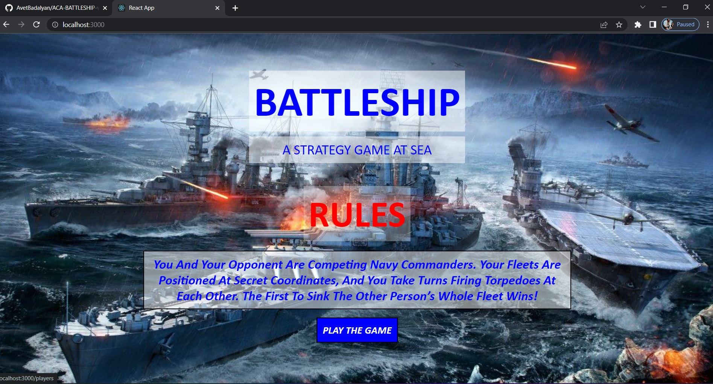

# 🚢 Battleship

A modern, single-player Battleship game built with React 19, TypeScript, and
Vite. Challenge yourself against an AI opponent with three difficulty levels!



## ✨ Features

### 🎮 Gameplay

- **Single-player vs AI** - Battle against a computer opponent
- **3 AI Difficulty Levels:**
  - 🟢 **Easy** - Random shots (good for beginners)
  - 🟡 **Medium** - Hunts adjacent cells after a hit
  - 🔴 **Hard** - Probability-based targeting with intelligent hunting
- **Standard Battleship Fleet:**
  - Carrier (5 cells)
  - Battleship (4 cells)
  - Cruiser (3 cells)
  - Submarine (3 cells)
  - Destroyer (2 cells)

### 🎨 Ship Placement

- Click-to-place ships on the board
- Rotate ships with **R key** or orientation button
- **Randomize** button for quick placement
- Visual preview showing valid/invalid positions
- Clear button to reset placement

### 📊 Game Stats

- Real-time tracking of shots fired, hits, and accuracy
- Ships remaining/destroyed counter
- Game timer
- End-game stats comparison

### 🎵 Audio & Visual Effects

- Synthesized sound effects (Web Audio API - no files needed!)
  - Explosion sounds for hits
  - Splash sounds for misses
  - Ship sinking audio
  - Victory/defeat fanfares
- Smooth animations with Framer Motion
- Water ripple effects on cells
- Hit/miss/sunk visual indicators

### 🌓 UI/UX

- **Dark/Light theme** toggle
- **Responsive design** - works on desktop and mobile
- Modern naval/military aesthetic
- Accessible keyboard controls

## 🛠️ Tech Stack

- **React 19** - Latest React with modern features
- **TypeScript** - Full type safety
- **Vite** - Fast build tool and dev server
- **Zustand** - Lightweight state management
- **Framer Motion** - Smooth animations
- **CSS Modules** - Scoped styling

## 🚀 Getting Started

### Prerequisites

- Node.js 18+
- npm or yarn

### Installation

```bash
# Clone the repository
git clone https://github.com/AvetBadalyan/ACA-BATTLESHIP-with-React.js.git
cd game-front

# Install dependencies
npm install

# Start development server
npm run dev
```

### Available Scripts

```bash
npm run dev      # Start development server
npm run build    # Build for production
npm run preview  # Preview production build
npm run lint     # Run ESLint
```

## 🎯 How to Play

1. **Setup Phase:**
   - Select a ship from the fleet panel
   - Click on your board to place it
   - Press `R` to rotate before placing
   - Use "Randomize" for quick setup
   - Click "Start Battle" when all ships are placed

2. **Battle Phase:**
   - Click on enemy waters to fire
   - Watch for hit 💥, miss 💨, or sunk 🔥 indicators
   - The AI will take its turn automatically
   - First to sink all enemy ships wins!

3. **Victory:**
   - View end-game stats and accuracy
   - Click "Play Again" for a rematch

## 📁 Project Structure

```
src/
├── components/       # React components
│   ├── Board/       # Game board with cells
│   ├── Cell/        # Individual cell with animations
│   ├── ShipSelector/# Ship selection panel
│   ├── GameStats/   # Stats display
│   ├── Header/      # App header with controls
│   ├── TurnIndicator/# Current turn display
│   └── GameOverModal/# End game modal
├── store/           # Zustand state management
├── types/           # TypeScript type definitions
├── utils/           # Game logic utilities
│   ├── board.ts     # Board operations
│   ├── ai.ts        # AI opponent logic
│   └── sounds.ts    # Sound effects
├── hooks/           # Custom React hooks
└── styles/          # Global styles and CSS variables
```

## 🤖 AI Difficulty Explained

### Easy Mode

- Completely random targeting
- No pattern recognition
- Good for learning the game

### Medium Mode

- Hunt/Target algorithm
- After a hit, tries adjacent cells
- Continues in the hit direction when finding the ship orientation

### Hard Mode

- Probability density mapping
- Calculates where ships are most likely to be
- Prioritizes center cells (statistically better)
- Smart hunting with direction detection

## 🔮 Future Enhancements

- [ ] Online multiplayer mode
- [ ] Game replay/history
- [ ] Custom board sizes
- [ ] More ship configurations
- [ ] Achievements/leaderboard
- [ ] PWA support for offline play

## 📝 License

This project is open source and available under the [MIT License](LICENSE).

## 👨‍💻 Author

**Avet Badalyan**

- GitHub: [@AvetBadalyan](https://github.com/AvetBadalyan)

---

Built with ❤️ and lots of ☕
