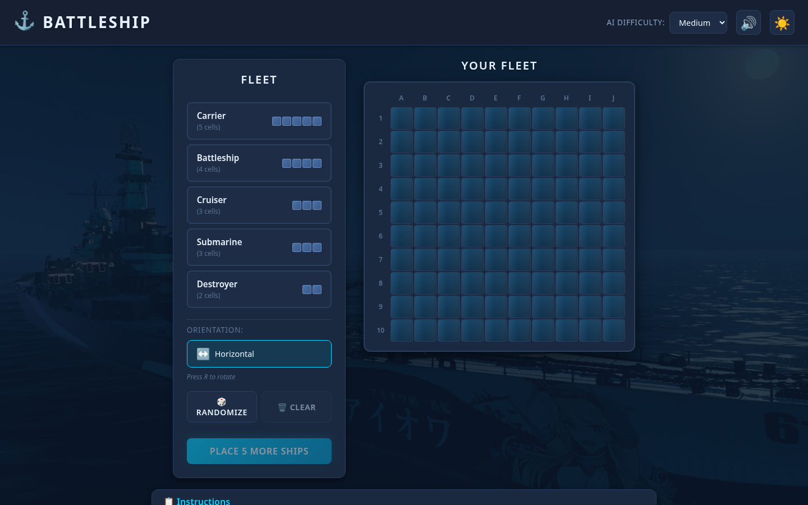
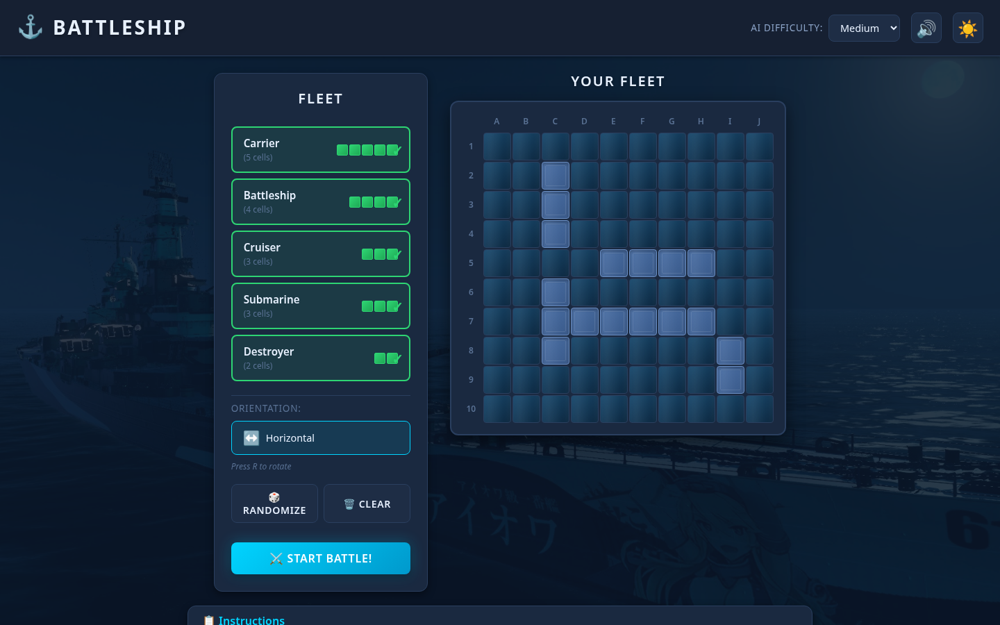
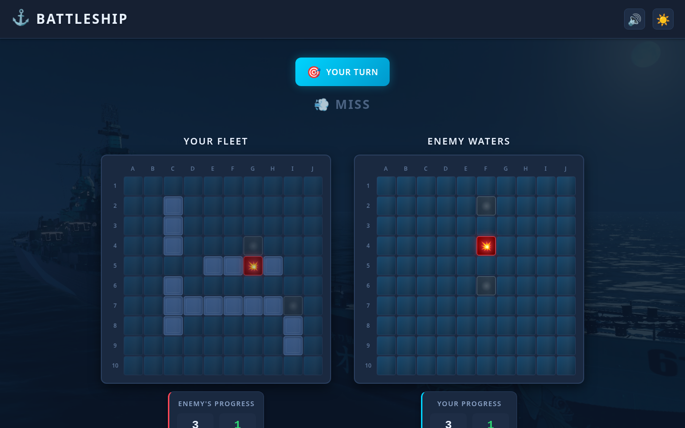
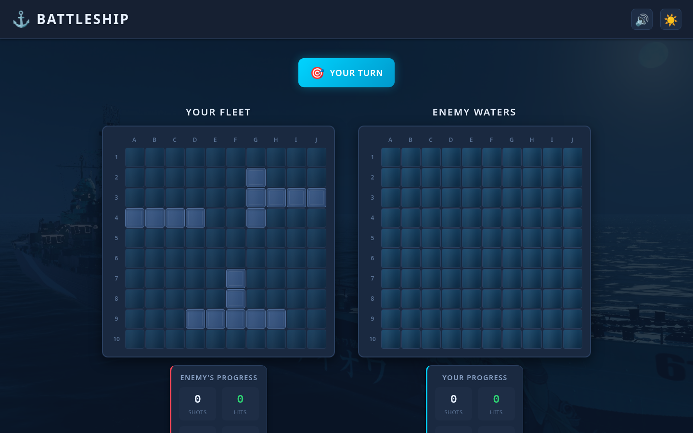
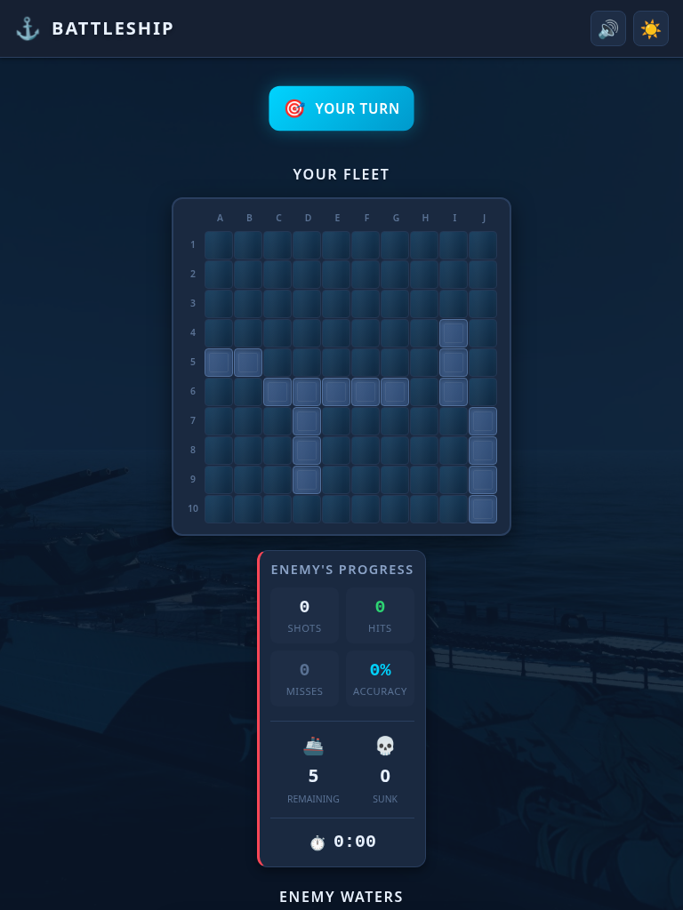
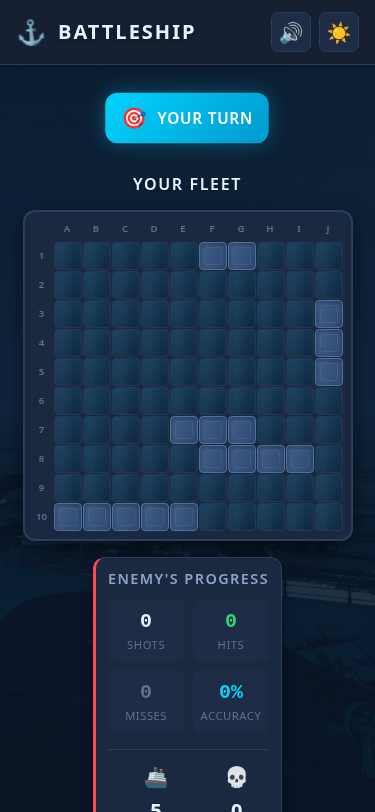
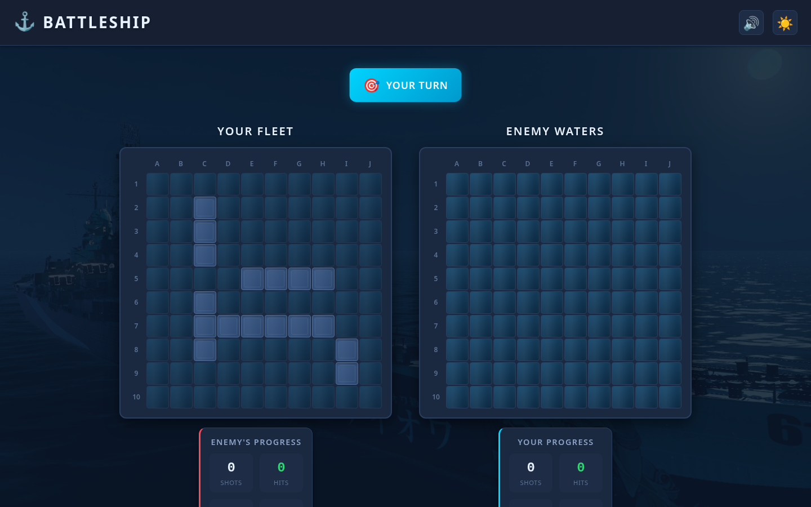
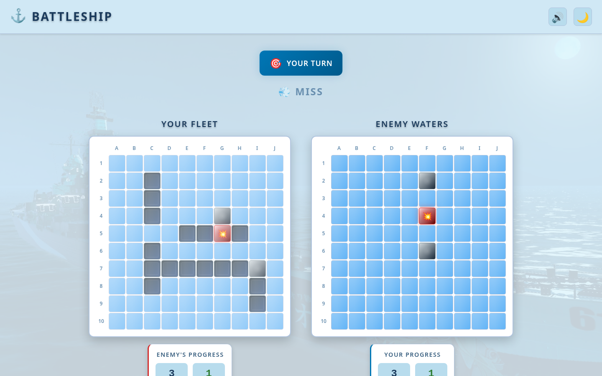

# 🚢 Battleship

A modern, single-player Battleship game built with React 19, TypeScript, and Vite. Challenge yourself against an AI opponent with three difficulty levels!

<p align="center">
  
</p>

## ✨ Features

### 🎮 Gameplay

- **Single-player vs AI** - Battle against a computer opponent
- **3 AI Difficulty Levels:**
  - 🟢 **Easy** - Random shots (good for beginners)
  - 🟡 **Medium** - Hunts adjacent cells after a hit
  - 🔴 **Hard** - Probability-based targeting with intelligent hunting
- **Standard Battleship Fleet:**
  - Carrier (5 cells)
  - Battleship (4 cells)
  - Cruiser (3 cells)
  - Submarine (3 cells)
  - Destroyer (2 cells)

### 🎨 Ship Placement

- Click-to-place ships on the board
- Rotate ships with **R key** or orientation button
- **Randomize** button for quick placement
- Visual preview showing valid/invalid positions
- Clear button to reset placement

<p align="center">
  
</p>

### 📊 Game Stats

- Real-time tracking of shots fired, hits, and accuracy
- Ships remaining/destroyed counter
- Game timer
- End-game stats comparison

### 🎵 Audio & Visual Effects

- Synthesized sound effects (Web Audio API - no files needed!)
  - Explosion sounds for hits
  - Splash sounds for misses
  - Ship sinking audio
  - Victory/defeat fanfares
- Smooth animations with Framer Motion
- Water ripple effects on cells
- Hit/miss/sunk visual indicators

### 🌓 UI/UX

- **Dark/Light theme** toggle
- **Responsive design** - works on desktop and mobile
- Modern naval/military aesthetic
- Accessible keyboard controls

<p align="center">
  
</p>

## 📱 Responsive Design

The game adapts to all screen sizes:

|                                         Desktop (1440px)                                         |                                         Tablet (768px)                                         |                                         Mobile (375px)                                         |
| :----------------------------------------------------------------------------------------------: | :--------------------------------------------------------------------------------------------: | :--------------------------------------------------------------------------------------------: |
|  |  |  |

## 🌗 Theme Support

|                                        Dark Theme                                         |                                       Light Theme                                       |
| :---------------------------------------------------------------------------------------: | :-------------------------------------------------------------------------------------: |
|  |  |

---

## 🛠️ Tech Stack

| Technology        | Purpose                           |
| ----------------- | --------------------------------- |
| **React 19**      | UI framework with latest features |
| **TypeScript**    | Type safety and better DX         |
| **Vite**          | Fast build tool and dev server    |
| **Zustand**       | Lightweight state management      |
| **Framer Motion** | Smooth animations                 |
| **CSS Modules**   | Scoped styling                    |
| **Web Audio API** | Synthesized sound effects         |

---

## 🚀 Getting Started

### Prerequisites

- Node.js 18+
- npm or yarn

### Installation

```bash
# Clone the repository
git clone https://github.com/AvetBadalyan/ACA-BATTLESHIP-with-React.js.git
cd ACA-BATTLESHIP-with-React.js/game-front

# Install dependencies
npm install

# Start development server
npm run dev
```

### Available Scripts

```bash
npm run dev      # Start development server (http://localhost:5173)
npm run build    # Build for production
npm run preview  # Preview production build
npm run lint     # Run ESLint
```

---

## 🎯 How to Play

### 1️⃣ Setup Phase

1. Select a ship from the fleet panel
2. Click on your board to place it
3. Press `R` to rotate before placing
4. Use "Randomize" for quick setup
5. Click "Start Battle" when all ships are placed

### 2️⃣ Battle Phase

1. Click on enemy waters to fire
2. Watch for hit 💥, miss 💨, or sunk 🔥 indicators
3. The AI will take its turn automatically
4. First to sink all enemy ships wins!

### 3️⃣ Victory

1. View end-game stats and accuracy
2. Click "Play Again" for a rematch

---

## 🏗️ Architecture Overview

For detailed architecture documentation, see [ARCHITECTURE.md](./ARCHITECTURE.md).

### Project Structure

```
src/
├── components/       # React UI components
│   ├── Board/       # 10x10 game grid
│   ├── Cell/        # Individual cell with animations
│   ├── ShipSelector/# Ship selection panel
│   └── ...
├── store/           # Zustand state management
│   └── gameStore.ts # Central game state & actions
├── types/           # TypeScript definitions
│   └── game.ts      # All shared types
├── utils/           # Game logic (pure functions)
│   ├── board.ts     # Board operations
│   ├── ai.ts        # AI algorithms
│   └── sounds.ts    # Web Audio API sounds
├── hooks/           # Custom React hooks
└── styles/          # CSS variables & global styles
```

### Data Flow

```
User Action → Component → Store Action → Utility Function → State Update → Re-render
```

### Key Design Patterns

| Pattern           | Usage                                |
| ----------------- | ------------------------------------ |
| **Immutability**  | All state updates create new objects |
| **State Machine** | Game phases and AI modes             |
| **Factory**       | Object creation functions            |
| **Strategy**      | AI difficulty algorithms             |
| **Singleton**     | Sound manager instance               |

---

## 🤖 AI Algorithms Explained

### Easy Mode: Random Targeting

- Picks a random untried cell
- No memory of previous shots
- **~95 shots** to win on average

### Medium Mode: Hunt/Target

- **Hunt**: Fire randomly until hit
- **Target**: After hit, try adjacent cells
- Detects ship direction after 2+ hits
- **~65 shots** to win on average

### Hard Mode: Probability Density

- Calculates probability for each cell
- More possible ship placements = higher probability
- Adds bonus for center cells
- **~42 shots** to win on average

---

## 📚 Interview Preparation

This project demonstrates several skills valuable for interviews:

### Technical Skills Demonstrated

| Skill                | Implementation                                  |
| -------------------- | ----------------------------------------------- |
| **React**            | Functional components, hooks, state management  |
| **TypeScript**       | Strict typing, interfaces, generics             |
| **State Management** | Zustand with persistence middleware             |
| **Algorithms**       | AI targeting (random, heuristic, probabilistic) |
| **Data Structures**  | 2D arrays, queues, stacks                       |
| **CSS**              | Variables, modules, responsive design           |
| **Web APIs**         | Web Audio API for sound synthesis               |
| **Build Tools**      | Vite configuration, TypeScript setup            |

### Common Interview Questions

<details>
<summary><strong>Q: Why did you choose Zustand over Redux or Context API?</strong></summary>

Zustand offers several advantages:

1. **Simpler API** - No boilerplate, no action types, no reducers
2. **Better Performance** - Components only re-render when their specific subscribed state changes
3. **No Provider Required** - Just import and use the hook
4. **Built-in Persistence** - Easy localStorage integration
5. **TypeScript Support** - First-class type inference

For a game with frequent state updates (every shot), performance is critical.
</details>

<details>
<summary><strong>Q: Explain how the AI difficulty levels work.</strong></summary>

**Easy**: Pure random targeting. O(n²) to collect untried cells, O(1) to pick one.

**Medium**: Hunt/Target algorithm using a state machine:

- Hunt mode: Random shots until a hit
- Target mode: Queue adjacent cells, try them systematically
- Back to hunt after sinking a ship

**Hard**: Probability density mapping:

1. For each remaining ship, count all valid placements
2. Each cell's probability = number of placements that cover it
3. Add bonus for center cells (statistically better)
4. Fire at highest probability cell

</details>

<details>
<summary><strong>Q: How do you handle state immutability?</strong></summary>

All state updates create new objects using:

- Spread operator: `{ ...object, property: newValue }`
- Array.map(): `array.map(item => ({...item}))`

This is crucial for:

1. React's change detection (reference equality)
2. Preventing accidental mutations
3. Enabling features like undo/redo (future)

Example from `processShot()`:

```typescript
// Create entirely new board
const newBoard = board.map((row) => row.map((cell) => ({ ...cell })));
// Then modify the copy
newBoard[pos.row][pos.col].state = 'hit';
```

</details>

<details>
<summary><strong>Q: Why use Web Audio API instead of audio files?</strong></summary>

Benefits:

1. **Smaller Bundle** - No audio files to download
2. **No HTTP Requests** - Sounds generated instantly
3. **Parameterizable** - Can modify sounds at runtime
4. **Works Offline** - No external dependencies
5. **Demonstrates API Knowledge** - Shows understanding of browser APIs

The sounds are created by combining oscillators (for tones) and noise generators (for explosions/splashes).
</details>

<details>
<summary><strong>Q: How would you add online multiplayer?</strong></summary>

The architecture makes this a small change:

1. **State Structure** - Already separates player and opponent data
2. **Isolated AI turn** - `aiTurn()` in the store is the only place that picks the opponent's move, and it delegates to the pure `getAIShot()` function
3. **Next step** - Introduce an `Opponent` interface so the local AI and a future remote player are interchangeable

```typescript
interface Opponent {
  makeMove(board: Board): Promise<Position>;
}

// Wraps the existing getAIShot() function
class AIOpponent implements Opponent { ... }

// Future: sends board state and awaits the other player's move
class RemoteOpponent implements Opponent {
  async makeMove(board: Board): Promise<Position> {
    return await this.socket.receive();
  }
}
```

> Note: the `Opponent` interface above does not exist yet — it's the refactor I'd do to add multiplayer. Today the AI is a pure function called from `aiTurn()`.

</details>

<details>
<summary><strong>Q: What's the time complexity of the Hard AI?</strong></summary>

**O(n² × k)** where:

- n = board size (10)
- k = sum of remaining ship sizes (max 17)

For each ship:

- Try all horizontal placements: O(n × (n - size))
- Try all vertical placements: O((n - size) × n)
- For each valid placement, increment probability of `size` cells

Worst case: ~10 × 10 × 17 = 1,700 operations per shot. Negligible for modern browsers.
</details>

### Code Reading Guide

For interviews, I recommend reviewing these files in order:

1. **`types/game.ts`** - Understand the data structures
2. **`utils/board.ts`** - Core game logic (place ships, process shots)
3. **`utils/ai.ts`** - AI algorithms (most interesting!)
4. **`store/gameStore.ts`** - State management and actions
5. **`components/Board/Board.tsx`** - React component patterns

Each file has extensive JSDoc comments with interview tips.

---

## 🔮 Future Enhancements

- [ ] Online multiplayer mode (WebSocket)
- [ ] Game replay/history
- [ ] Custom board sizes
- [ ] More ship configurations
- [ ] Achievements/leaderboard
- [ ] PWA support for offline play
- [ ] Unit and integration tests

---

## 📝 License

This project is open source and available under the [MIT License](LICENSE).

## 👨‍💻 Author

**Avet Badalyan**

- GitHub: [@AvetBadalyan](https://github.com/AvetBadalyan)

---

<p align="center">
  Built with ❤️ and lots of ☕
</p>
